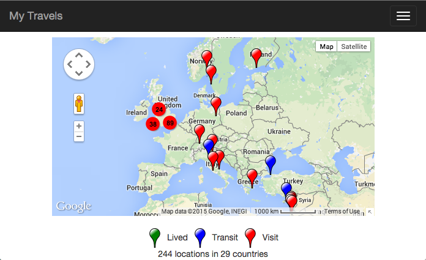

### Introduction

I've travaled a lot and kept track of the places I've been.  I wanted to store this data and be able to display it but all online tools I've used for this purpose have either held my data hostage or gone out of business.

I set out to create a simple site that keeps my travels in YAML files without any databases or hard to manage dependencies.  You can manage it completely using just Git, a text editor and a free account at Heroku.

Your data is in a simple to parse YAML format and the site provides end points to convert it to JSON or industry standard [KML](http://en.wikipedia.org/wiki/Keyhole_Markup_Language).

My own travels built using this software can be seen [here](http://travels.devco.net/).

Follow the links to the left to learn how to install, configure and add points.

### Features

  * Responsive design that works on mobile and PC
  * A menu of pre-defined views so you can draw attention to a certain area of the map
  * Points can be catagorized by type of visit like places you've lived, visited or transited through.  Each with their own icon.
  * Points can have urls, text, images and dates associated with them
  * Point clustering that combines many points into one when zoomed out with extensive configuration options
  * Several sets of colored icons for point types and clusters
  * A web based tool to help you construct the YAML snippets needed using search
  * Optional authentication around the geocoder
  * Google Analytics support
  * Export to KML for viewing in tools like Google Earth
  * Full control over the Google Map like enabling or disabling the street view options
